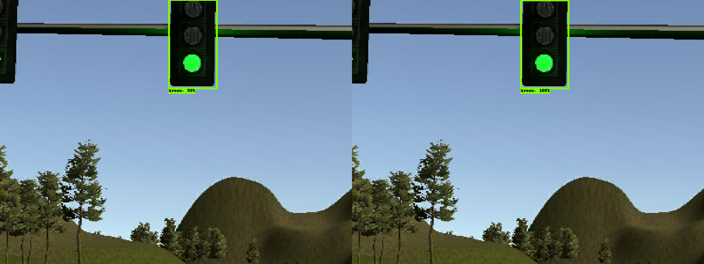
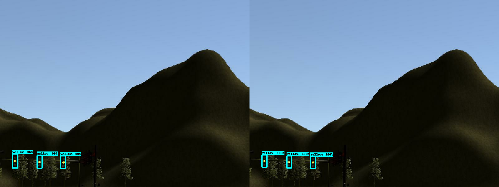
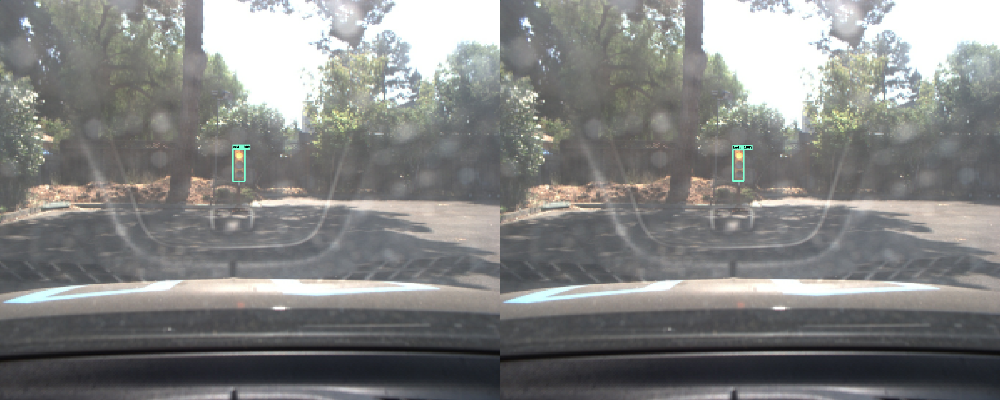
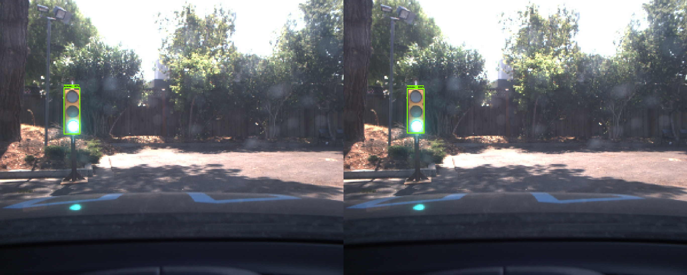

# SelfDrivingCar---Traffic-Light-Detection

## Table of Contents
- [Overview](## Overview)
-[Models](# Models)

## Overview
Following repository is dedicated for traffic light detection node used in the capston project of Udacity's Self Driving Car Nanodegree program.
Traffic light detection node is required to detect traffic light and classify the state: Red, yellow, and green. This is required for vehicle to decide whether to stop or continue driving at the stop line.
Key factors of traffic light detector are detection timing and accuracy of prediction. Detection time is one of the key factor as predicted state is needed for future action of vehicle and is directly connected to safety of passengers. Also accuracy is key factor as making false decision by inaccurate prediction of traffic light could lead to car accident.
All prediction models are trained through use of [TensorFlow Object Detection API](https://github.com/tensorflow/models/tree/master/research/object_detection). Also, all the models used in following project were downloaded from [TensorFlow Model Zoo](https://github.com/tensorflow/models/blob/master/research/object_detection/g3doc/detection_model_zoo.md).


## Models
Four different models were chosen as candidates and downloaded from [TensorFlow Model Zoo](https://github.com/tensorflow/models/blob/master/research/object_detection/g3doc/detection_model_zoo.md). All four models were pre-trained with [COCO Dataset](http://cocodataset.org/), which already contains traffic lights category. Below are the model's reported speed, accuracy, configuration template, and training configuration used.

| Model name  | Reported Speed (ms) | Reported COCO mAP[^1] | Template Config | Used Config |
| ------------ | :--------------: | :--------------: | :--------------: | :--------------: |
| [ssd_mobilenet_v1_coco](http://download.tensorflow.org/models/object_detection/ssd_mobilenet_v1_coco_2018_01_28.tar.gz) | 30 | 21 | [Download](https://raw.githubusercontent.com/tensorflow/models/master/research/object_detection/samples/configs/ssd_mobilenet_v1_coco.config) | [Download](https://raw.githubusercontent.com/KibaekJeong/SelfDrivingCar---Traffic-Light-Detectioon/master/configs/ssd_mobilenet_v1.config)
| [ssd_mobilenet_v2_coco](http://download.tensorflow.org/models/object_detection/ssd_mobilenet_v2_coco_2018_03_29.tar.gz) | 31 | 22 | [Download](https://raw.githubusercontent.com/tensorflow/models/master/research/object_detection/samples/configs/ssd_mobilenet_v2_coco.config) | [Download](https://raw.githubusercontent.com/KibaekJeong/SelfDrivingCar---Traffic-Light-Detectioon/master/configs/ssd_mobilenet_v2.config)
| [ssd_inception_v2_coco](http://download.tensorflow.org/models/object_detection/ssd_inception_v2_coco_2018_01_28.tar.gz) | 42 | 24 | [Download](https://raw.githubusercontent.com/tensorflow/models/master/research/object_detection/samples/configs/ssd_inception_v2_coco.config) | [Download](https://raw.githubusercontent.com/KibaekJeong/SelfDrivingCar---Traffic-Light-Detectioon/master/configs/ssd_inception_v2.config)
| [faster_rcnn_inception_v2_coco](http://download.tensorflow.org/models/object_detection/faster_rcnn_inception_v2_coco_2018_01_28.tar.gz) | 58 | 28 | [Download](https://raw.githubusercontent.com/tensorflow/models/master/research/object_detection/samples/configs/faster_rcnn_inception_v2_coco.config) | [Download](https://raw.githubusercontent.com/KibaekJeong/SelfDrivingCar---Traffic-Light-Detectioon/master/configs/faster_rcnn_inception_v2.config)


## Training
All four models has common  configuration:
* Number of classes: 4
* Batch size: 24
* Training Steps: 150000
* Learning Rate: 0.004

### Training Locally
Following steps are for training the models locally:
1. Download pre-trained model from the [TensorFlow Model Zoo](https://github.com/tensorflow/models/blob/master/research/object_detection/g3doc/detection_model_zoo.md)
2. Write and prepare pipeline configuration
3. Download the [TensorFlow Object Detection API](https://github.com/tensorflow/models/tree/master/research/object_detection) and follow these installation steps:
      * Clone the tensorflow object models repo:

           ```
           git clone https://github.com/tensorflow/models.git
           ```
      * Run setup.py file

          ```
          # From tensorflow/models/research
          python setup.py built
          python setup.py install
          ```
      * Add slim folder as python path

          ```
          export PYTHONPATH=$PYTHONpATH:pwd:pwd/slim
          ```
4. Prepare all the required files for Training
      * Recommended Directory Structure

          ```
          +data
          -label_map file
          -train TFRecord file
          -eval TFRecord file
          +models
          + model
          -pipeline config file
          +train
          +eval
          ```
5. Run the training job
      * Run the following command
          ```
          #From the tensorflow/models/research/ directory
          python object_detection/model_main.py \
          --pipeline_config_path=${PIPELINE_CONFIG_PATH} \
          --model_dir=${MODEL_DIR} \
          --alsologtostderr
          ```

6. Check out tensorboard to observe training process
      * Run
          ```
          tensorboard --logdir=${MODEL_DIR}
          ```
      * Navigate to ```localhost:6006``` from your favorite web browser


### Training with google cloud service
Following steps are for training the models using google cloud service:

#### Setting up Google cloud
[Google Cloud AI Platform](https://cloud.google.com/products/ai/) can accelerate the training process by leveraging multiple GPUs. To begin, Google Cloud project needs to be set up via following steps:
1. [Create a GCP project](https://cloud.google.com/resource-manager/docs/creating-managing-projects)
2. [Install the Google Cloud SDK](https://cloud.google.com/sdk/install)
3. [Enable the AI platform Training & Prediction API](https://console.cloud.google.com/flows/enableapi?apiid=ml.googleapis.com,compute_component&_ga=1.73374291.1570145678.1496689256)
4. [Set up a Google Cloud Storage (GCS) bucket](https://cloud.google.com/storage/docs/creating-buckets)

#### Training using Google Cloud
1. Download pre-trained model from the [TensorFlow Model Zoo](https://github.com/tensorflow/models/blob/master/research/object_detection/g3doc/detection_model_zoo.md)
2. Write and prepare pipeline configuration
3. Download the [TensorFlow Object Detection API](https://github.com/tensorflow/models/tree/master/research/object_detection) and follow these installation steps:
      * Clone the tensorflow object models repo:

           ```
           git clone https://github.com/tensorflow/models.git
           ```
      * Run setup.py file:

            #From tensorflow/models/research
            python setup.py built
            python setup.py install

      * Add slim folder as python path:

            export PYTHONPATH=$PYTHONpATH:pwd:pwd/slim


4. Upload all the files to Google Cloud Storage bucket
      * Upload tfrecord and pbtxt files

            gsutil cp train.tfrecord gs://${YOUR_GCS_BUCKET}/data/
            gsutil cp valid.tfrecord gs://${YOUR_GCS_BUCKET}/data/
            gsutil cp label_map.pbtxt gs://${YOUR_GCS_BUCKET}/data/label_map.pbtxt


      * Upload model files

            gsutil cp faster_rcnn_inception_v2_coco_2018_01_28/model.ckpt.* gs://${YOUR_GCS_BUCKET}/data/


      * Upload configuration file

            gsutil cp faster_rcnn_inception_v2.config gs://${YOUR_GCS_BUCKET}/data/faster_rcnn_inception_v2.config

5. Run the training job

            gcloud ai-platform jobs submit training `whoami`_object_detection_pets_`date +%m_%d_%Y_%H_%M_%S` \
                --runtime-version 1.12 \
                --job-dir=gs://${YOUR_GCS_BUCKET}/model_dir \
                --packages dist/object_detection-0.1.tar.gz,slim/dist/slim-0.1.tar.gz,/tmp/pycocotools/pycocotools-2.0.tar.gz \
                --module-name object_detection.model_main \
                --region us-central1 \
                --config object_detection/samples/cloud/cloud.yml \
                -- \
                --model_dir=gs://${YOUR_GCS_BUCKET}/model_dir \
                --pipeline_config_path=gs://${YOUR_GCS_BUCKET}/data/faster_rcnn_inception_v2.config

6. Check out tensorboard to observe training process

            tensorboard --logdir=${MODEL_DIR}

7. Navigate to ```localhost:6006``` from your favorite web browser          

## Exporting
### Tensorflow 1.14
In order to use trained model for inference, models needs to be frozen. This can be done using utility included in tensorflow object API.

```
python object_detection/export_inference_graph.py \
    --input_type=image_tensor \
    --pipeline_config_path=config/faster_rcnn_inception_v2.config \
    --trained_checkpoint_prefix=models/model.ckpt-150006 \
    --output_directory=exported_graphs
```
### Tensorflow 1.3.0
From the Capstone project of Self-Driving car Nanodegree program, system requires to run in tensorflow version of 1.3.0. Therefore, inference model is also required to be able to run in Tensorflow 1.3.0. Pre-trained models from [TensorFlow Model Zoo](https://github.com/tensorflow/models/blob/master/research/object_detection/g3doc/detection_model_zoo.md) also are not compatible in Tensorflow 1.3.0.
In order to make models to work in Tensorflow 1.3.0, all the models has to be frozen in lower version of Tensorflow. Training can be done in higher version of Tensorflow, but graph freezing needs to be done in lower version, here, we will perform model freezing in Tensorflow 1.4.0:

1. Create virtual environment using anaconda
    ```
    conda create -n tensorflow_1.4 python=3.6
    conda activate tensorflow_1.4
    ```

2. Install Tensorflow 1.4.0:
    ```
    conda install tensorflow==1.4.0
    ```

3. Install dependencies:
    ```
    conda install pillow lxml matplotlib
    ```

4. Clone Tensorflow version of 1.4.0:
    ```
    git clone https://github.com/tensorflow/models.git
    git checkout d135ed9c04bc9c60ea58f493559e60bc7673beb7
    ```

5. Setup the Tensorflow
    ```
    #From tensorflow/models/research
    python setup.py built
    python setup.py install
    ```
6. Compile proto buffers
    ```
    protoc.exe object_detection/protos/*.proto --python_out=.
    ```
7. Export python path:
    ```
    export PYTHONPATH=$PYTHONpATH:pwd:pwd/slim
    ```
8. Export frozen model:
    ```
    python object_detection/export_inference_graph.py \
        --input_type=image_tensor \
        --pipeline_config_path=config/faster_rcnn_inception_v2.config \
        --trained_checkpoint_prefix=models/model.ckpt-150006 \
        --output_directory=exported_graphs
    ```

## Optimizing
After all the models are frozen, all the variables are turned into constants. We are able to perform optimizations to decrease the inference timing and size. Optimizing is performed by removing unused variables and folding operations. In following repository, python file is included to optimize frozen graphs. To perform optimization:
```
Python optimize_tf_graph.py\
    --model_path=${PATH_TO_MODEL}/frozen_inference_graph.pb
```
## Evaluation
| Prediction      /     Ground Truth |
| -----------------------------------|








In evaluation of the inference model, main focus was whether model can classify the traffic light rather than Intersection of Union(IOU) of prediction box. Therefore, evaluation is done whether prediction of inference graph matches with ground truth state of traffic light. Evaluation is done with a jupyter notebook, included in repository.

As final result, all models were able to perform high accuracy, while ssd mobilenet v1 and v2 performed with much faster detection timing. Among all the models, ssd mobilenet v2 was chosen for final model as it was able to perform with lowest detection time. Accuracy has been measured for two separate set of data, data from Udacity and data from Bosch traffic light dataset. Data from Udacity includes both simulation and on-site images.

| Model                              |                Acc (Udacity)               |               Acc (BSTLD)               |             GPU Time (ms)             |               Optimized (ms)              |             CPU Time (ms)             |               Optimized (ms)              |
|------------------------------------|:--------------------------------------:|:--------------------------------------:|:-------------------------------------:|:-------------------------------------:|:-------------------------------------:|:-------------------------------------:|
| ssd_mobilenet_v1                   |                  1.0                 |                  0.992                 |                    22.49                   |                    21.03                   |                     25.35                    |                   24.41                 |
| **ssd_mobilenet_v2**                   |                  1.0                 |                  0.992                 |                    22.01                   |                    20.86                   |                     22.35                    |                   20.90                   |
| Faster_rcnn_inception_v2              |                  1.0                 |                  0.9909                 |                  95.61                 |                  92.17                 |                   110.79                  |                   108.50                  |
| ssd_inception_v2                   |                  1.0                 |                  0.9942                |                    42.30                   |                     40.72                    |                      44.24                    |                    41.80                   |
