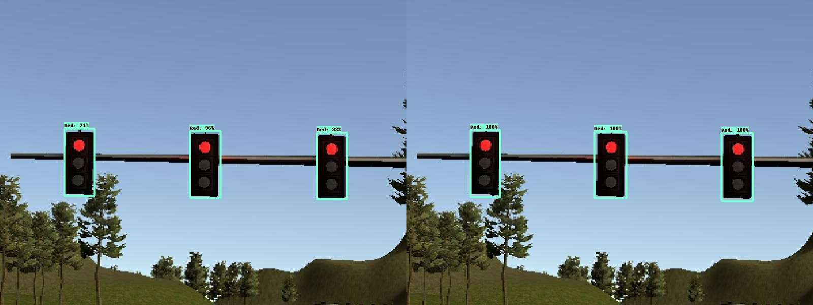
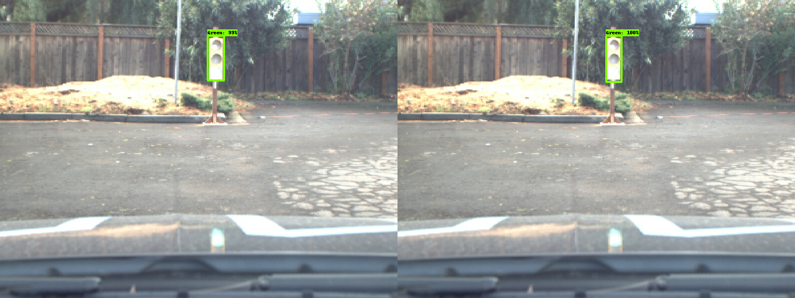

# SelfDrivingCar---Traffic-Light-Detection
Following repository is dedicated for traffic light detection node used in the capston project of Udacity's Self Driving Car Nanodegree program.
Traffic light detection node is required to detect traffic light and classify the state: Red, yellow, and green. This is required for vehicle to decide whether to stop or continue driving at the stop line.
Key factors of traffic light detector are detection timing and accuracy of prediction. Detection time is one of the key factor as predicted state is needed for future action of vehicle and is directly connected to safety of passengers. Also accuracy is key factor as making false decision by inaccurate prediction of traffic light could lead to car accident.
All prediction models are trained through use of [TensorFlow Object Detection API](https://github.com/tensorflow/models/tree/master/research/object_detection). Also, all the models used in following project were downloaded from [TensorFlow Model Zoo](https://github.com/tensorflow/models/blob/master/research/object_detection/g3doc/detection_model_zoo.md).
## models
Four different models were chosen as candidates and downloaded from [TensorFlow Model Zoo](https://github.com/tensorflow/models/blob/master/research/object_detection/g3doc/detection_model_zoo.md). All four models were pre-trained with [COCO Dataset](http://cocodataset.org/), which already contains traffic lights category. Below are the model's reported speed, accuracy, configuration template, and training configuration used.

| Model name  | Reported Speed (ms) | Reported COCO mAP[^1] | Template Config | Used Config |
| ------------ | :--------------: | :--------------: | :--------------: | :--------------: |
| [ssd_mobilenet_v1_coco](http://download.tensorflow.org/models/object_detection/ssd_mobilenet_v1_coco_2018_01_28.tar.gz) | 30 | 21 | [Download](https://raw.githubusercontent.com/tensorflow/models/master/research/object_detection/samples/configs/ssd_mobilenet_v1_coco.config) | [Download](https://raw.githubusercontent.com/KibaekJeong/SelfDrivingCar---Traffic-Light-Detectioon/master/configs/ssd_mobilenet_v1.config)
| [ssd_mobilenet_v2_coco](http://download.tensorflow.org/models/object_detection/ssd_mobilenet_v2_coco_2018_03_29.tar.gz) | 31 | 22 | [Download](https://raw.githubusercontent.com/tensorflow/models/master/research/object_detection/samples/configs/ssd_mobilenet_v2_coco.config) | [Download](https://raw.githubusercontent.com/KibaekJeong/SelfDrivingCar---Traffic-Light-Detectioon/master/configs/ssd_mobilenet_v2.config)
| [ssd_inception_v2_coco](http://download.tensorflow.org/models/object_detection/ssd_inception_v2_coco_2018_01_28.tar.gz) | 42 | 24 | [Download](https://raw.githubusercontent.com/tensorflow/models/master/research/object_detection/samples/configs/ssd_inception_v2_coco.config) | [Download](https://raw.githubusercontent.com/KibaekJeong/SelfDrivingCar---Traffic-Light-Detectioon/master/configs/ssd_inception_v2.config)
| [faster_rcnn_inception_v2_coco](http://download.tensorflow.org/models/object_detection/faster_rcnn_inception_v2_coco_2018_01_28.tar.gz) | 58 | 28 | [Download](https://raw.githubusercontent.com/tensorflow/models/master/research/object_detection/samples/configs/faster_rcnn_inception_v2_coco.config) | [Download](https://raw.githubusercontent.com/KibaekJeong/SelfDrivingCar---Traffic-Light-Detectioon/master/configs/faster_rcnn_inception_v2.config)

## Training
All four models has common  configuration:
* Number of classes: 4
* Batch size: 24
* Training Steps: 150000
* Learning Rate: 0.004

### Training Locally

### Training with google cloud service

## Exporting
### Tensorflow 1.14

### Tensorflow 1.3.0

## Evaluation
| Prediction        /       Ground Truth |
| ---------------------------|

